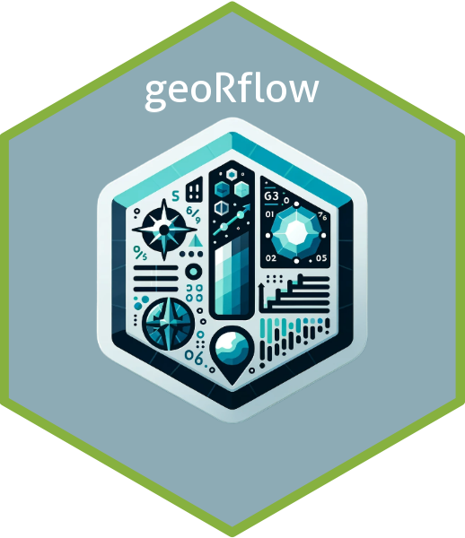

# geoRflow
geoRflow is an R package designed to facilitate automated workflows for processing and analyzing geospatial data. With a focus on simplicity and efficiency, geoRflow provides a suite of functions to handle various geospatial data operations such as loading data, extracting raster layers, resampling, reprojecting, extracting point values, and performing data validation.

## Installation
You can install the development version of geoRflow from GitHub with:
```{r}
# install.packages("devtools")
devtools::install_github(""SamMajumder/geoRflow"")
```

## Functions

### 1) geoRflow_raster_pipeline_point

#### Description
This function processes a list of geospatial raster data files or objects, resamples them, reprojects them to a specified CRS, and extracts values at specified point locations from a data frame.

#### Usage
```r
geoRflow_raster_pipeline_point(
  inputs,
  df = NULL,
  lat_col = NULL,
  lon_col = NULL,
  split_id = NULL,
  search_strings = NULL,
  method = "stars",
  resample_factor = NULL,
  crs = st_crs(4326),
  method_resampling = "bilinear",
  no_data_value = -9999,
  reference_shape = NULL,
  use_bilinear = TRUE
)
```

#### Arguments
- `inputs`: A list of file paths or raster objects to be processed.
- `df`: A data frame containing point data (default is NULL).
- `lat_col`: The name of the column in 'df' that contains latitude values (default is NULL).
- `lon_col`: The name of the column in 'df' that contains longitude values (default is NULL).
- `split_id`: The name of the column in 'df' to split the data frame on for processing (default is NULL).
- `search_strings`: A list of strings for filtering files (default is NULL, not currently used in function).
- `method`: The method for loading and processing raster data, either "stars" or "terra" (default is "stars").
- `resample_factor`: A numeric value to rescale the raster data (default is NULL).
- `crs`: The coordinate reference system to be used for the raster data (default is st_crs(4326)).
- `method_resampling`: The method used for resampling when changing raster resolution (default is "bilinear").
- `no_data_value`: The value to be used for missing data in the raster (default is -9999).
- `reference_shape`: A file path or spatial object for cropping the raster (default is NULL).
- `use_bilinear`: Logical, whether to use bilinear interpolation when extracting raster values (default is TRUE).

#### Examples
##### Basic Usage (No Optional Arguments):
This is the simplest form of calling the function, assuming that the mandatory arguments are provided.

```{r}
geoRflow_raster_pipeline_point(inputs = list_of_rasters)
```

#### Specifying the Data Frame:
Adding the data frame that contains the point data.

```{r}
geoRflow_raster_pipeline_point(inputs = list_of_rasters, df = my_data_frame)
```
#### Specifying Latitude and Longitude Columns:
Including the names of the columns that contain the latitude and longitude values.

```{r}
geoRflow_raster_pipeline_point(inputs = list_of_rasters,
                               df = my_data_frame,
                               lat_col = "latitude",
                               lon_col = "longitude")
```

#### Including a Split ID:
Adding a column name to split the data frame for processing.

```{r}
geoRflow_raster_pipeline_point(inputs = list_of_rasters,
                               df = my_data_frame,
                               lat_col = "latitude",
                               lon_col = "longitude",
                               split_id = "region_id")

```

#### Using Search Strings for Filtering:
Although not currently used in the function, we can include it for completeness.

```{r}
geoRflow_raster_pipeline_point(inputs = list_of_rasters,
                               df = my_data_frame,
                               lat_col = "latitude",
                               lon_col = "longitude",
                               split_id = "region_id",
                               search_strings = c("string1", "string2"))

```

#### Changing the Method for Raster Processing:
Switching from the default "stars" method to "terra".

```{r}
geoRflow_raster_pipeline_point(inputs = list_of_rasters,
                               df = my_data_frame,
                               lat_col = "latitude",
                               lon_col = "longitude",
                               split_id = "region_id",
                               method = "terra")

```
#### Adjusting the Resample Factor:
Specifying a numeric value to rescale the raster data.
```{r}
geoRflow_raster_pipeline_point(inputs = list_of_rasters,
                               df = my_data_frame,
                               lat_col = "latitude",
                               lon_col = "longitude",
                               split_id = "region_id",
                               resample_factor = 0.5)

```
#### Changing the Coordinate Reference System (CRS):
Setting a different CRS for the raster data.

```{r}
geoRflow_raster_pipeline_point(inputs = list_of_rasters,
                               df = my_data_frame,
                               lat_col = "latitude",
                               lon_col = "longitude",
                               split_id = "region_id",
                               crs = st_crs(3857))

```

#### Modifying the Resampling Method:
Changing the resampling method when altering raster resolution.

```{r}
geoRflow_raster_pipeline_point(inputs = list_of_rasters,
                               df = my_data_frame,
                               lat_col = "latitude",
                               lon_col = "longitude",
                               split_id = "region_id",
                               method_resampling = "nearest")

```

#### Setting a No Data Value:
Defining a different value for missing data in the raster.

```{r}
geoRflow_raster_pipeline_point(inputs = list_of_rasters,
                               df = my_data_frame,
                               lat_col = "latitude",
                               lon_col = "longitude",
                               split_id = "region_id",
                               no_data_value = -999)

```

#### Cropping with a Reference Shape:
Providing a file path or spatial object for cropping the raster.

```{r}
geoRflow_raster_pipeline_point(inputs = list_of_rasters,
                               df = my_data_frame,
                               lat_col = "latitude",
                               lon_col = "longitude",
                               split_id = "region_id",
                               reference_shape = "path/to/shapefile.shp")

```

#### Disabling Bilinear Interpolation:
Turning off bilinear interpolation when extracting raster values.

```{r}
geoRflow_raster_pipeline_point(inputs = list_of_rasters,
                               df = my_data_frame,
                               lat_col = "latitude",
                               lon_col = "longitude",
                               split_id = "region_id",
                               use_bilinear = FALSE)

```

### 2) geoRflow_export_layers

#### Description
The geoRflow_export_layers function is designed to streamline the process of exporting individual layers from a NetCDF file. It accepts a raster object, either a RasterBrick or SpatRaster, and exports each specified layer as a separate GeoTIFF file.

#### Usage
```{r}

geoRflow_export_layers(raster_object, layer_indices, output_dir = getwd())
```

##### Arguments
`raster_object:` A RasterBrick or SpatRaster object representing the raster data.
`layer_indices:` A numeric vector specifying the indices of the layers to be exported.
`output_dir:` A string representing the directory path where the GeoTIFF files will be saved. If not specified, the current working directory is used by default.

##### Value
The function returns an invisible NULL as it is used for the side effect of writing files to the disk.

##### Examples
Here are some examples of how to use the geoRflow_export_layers function:

###### Assuming 'raster_brick' is a RasterBrick object with multiple layers

```{r}
geoRflow_export_layers(raster_brick, layer_indices = 1:10, output_dir = "path/to/output")

```

###### If 'spat_raster' is a SpatRaster object with multiple layers

```{r}
geoRflow_export_layers(spat_raster, layer_indices = c(2, 5, 7), output_dir = "path/to/different/output")
```

###### To export all layers from a RasterBrick object

```{r}
all_layers <- 1:nlayers(raster_brick)
geoRflow_export_layers(raster_brick, layer_indices = all_layers, output_dir = "path/to/all/layers")
```

###### To export layers by specifying a range
```{r}
geoRflow_export_layers(raster_brick, layer_indices = 3:8, output_dir = "path/to/selected/layers")
```

###### To export a single layer
```{r}
geoRflow_export_layers(raster_brick, layer_indices = 5, output_dir = "path/to/single/layer")
```

###### Assuming the working directory is the desired output directory
```{r}
geoRflow_export_layers(raster_brick, layer_indices = 1:10)
```

###### Using a SpatRaster object and specifying a non-existent directory (it will be created)
```{r}
geoRflow_export_layers(spat_raster, layer_indices = 1:5, output_dir = "path/to/new/output/dir")
```

### 3) geoRflow_process_dataframes
The geoRflow_process_dataframes function is designed to streamline the process of extracting and processing data frames from a list structure, which is typically the output of the geoRflow_raster_pipeline_point function. This function allows users to specify the element to extract, apply transformations, and combine the results into a single data frame.

#### Description
This function iterates over a list of data frames, extracting specified elements, and optionally renaming columns. It is particularly useful when dealing with the output of geospatial data processing workflows where the results are stored in complex list structures.

#### Usage
```{r}
geoRflow_process_dataframes(temp_list, element_name, new_col_names, extract_index = 1)
```

#### Arguments
`temp_list:` A list containing data frames from which to extract elements.
`element_name:` The name of the element within the list to be processed.
`new_col_names:` A vector of new column names to be assigned to the processed data frames.
`extract_index:` The index of the element to extract from each list-column (default is 1).

#### Details
The function checks if the specified element exists in the provided list. If it does, it proceeds to process each data frame within the list. Non-data frame or non-matrix columns are kept as is, while data frames or matrices have their non-ID columns extracted and converted into a list. The function then flattens any list-columns and renames the columns according to new_col_names. All processed data frames are then combined into one large data frame.

### Examples
```{r}
# Assuming 'result_list' is the output from geoRflow_raster_pipeline_point
# and contains an element named 'extracted_values' which is a list of data frames

# Process the 'extracted_values' element with new column names
processed_df <- geoRflow_process_dataframes(
  temp_list = result_list,
  element_name = "extracted_values",
  new_col_names = c("Latitude", "Longitude", "Elevation")
)
```

### Note
Ensure that the new_col_names provided matches the number of columns in the data frames being processed. If they do not match, a warning will be issued.


## License
geoRflow is released under the MIT License.

## 👤 Maintainer:

Sambadi Majumder, PhD
sambadimajumder@gmail.com
